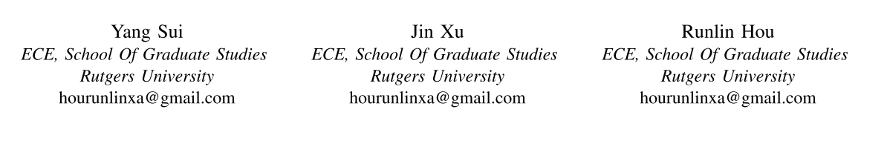

# Self-playing Snake Game based on Pathfinding Algorithms

## II. A* APPROACH

Although BFS algorithm is a very useful approach for a path finding problem, it is not an efficient algorithm. In this section, we use the A* (also known as "A star") path finding algorithm to implement our goals. A* can also find the shortest(or longest) path, but it has a smaller time complexity and a greater space complexity compared to BFS. 

### Introduction

Generally speaking, A* algorithm is an advanced version of Dijkstra's algorithm that use a heuristic function to guide its searching path in order to improve the performance. During the searching, instead of just consider the weight of edges like Dijkstra's algorithm, A* also utilize the information of the positions of the vertices. In other word, A* is an informed algorithm. 

If we look at the searching processes of Dijkstra's algorithm and A* , it is easy to tell that A* is much smarter. It behaves like it has already known where the destination vertex is and follows the most possible direction at each action. 

A* algorithm can be seen as the combination of Dijkstra's algorithm and Greedy algorithm. We will give a short explanation of them first and finally talk about our implementation of A*. In the following sections, we would use the 2-D square grid as the graph example, which is also the model of our snake game map.

### Dijkstra's Algorithm & Greedy Algorithm

The strategy of Dijkstra's algorithm can be explained as the followings:

- Visit the current vertex **C**, calculate the cost to all it neighbors
- Enqueue a neighbor if it is unvisited or the new cost is smaller than old cost
- Save the costs into an array **disTo**, and renew array **prev**
- From **pq**, select the one that has minimum cost and visit it.

Note that the cost is defined as the sum of weights of the edges all along the path, so it tends to visit the neighbors that have smaller weight.

However, in our model, the edges are equal-weighted and every neighbor has equal cost. So, as discussed previously, the actual behavior of Dijkstra's algorithm is the same as BFS. Fig II.1 shows an example of Dijkstra's searching process.

[^Fig II.1]: Searching process of Dijkstra's algorithm in an equal-weighted graph. The pink node is the starting point and the blue node is the destination. The dash line is the actual path and the colored area marks where the algorithm has visited.

The major advantage of Dijkstra's algorithm is that it always can find the shortest path if it is existed.

The Greedy algorithm follows a very simple strategy: visit the neighbor that has the smallest distance to destination every time. Here we need to use a measurement to define the distance in a 2-D graph. The most common used measurements includes Manhattan distance and Euclidean distance:
$$
Manhattan \ \ Distance = |x_1-x_2|+|y_1-y_2|
$$

$$
Euclidean \ \ Distance = \sqrt{(x_1-x_2)^2+(y_1-y_2)^2}
$$

The implementation is also simple:

- Visit current vertex **C**, mark **C** visited
- Calculate the distances for all its neighbor, visit the one has the smallest distance

Fig II.2 shows an example of Greedy algorithm searching process.

[^Fig II.2]: Searching process of Greedy algorithm for the same starting vertex and ending vertex.

Obviously, Greedy algorithm is very efficient. It acts like it knows where the destination is and use less time to find the shortest path compared to Dijkstra's algorithm.

However, if there is a "wall"(or unreachable vertices) between the starting vertex and ending vertex, Greedy algorithm cannot find the shortest path, the following figure illustrates such situations.

[^Fig II.3]: Searching process of Greedy algorithm when there is impediment between starting vertex and ending vertex.

### A* Algorithm &  Implementation

The initial idea of A* algorithm is to take the Greedy approach as a heuristic information and combine it with Dijkstra's approach. It also use a priority queue for selecting the minimum cost in each iteration. But the cost function is different:
$$
f(n) = g(n)+h(n;d)
$$
Here $f(n)$ is the cost from starting point **s** to vertex **n**, $g(n)$ is the sum of weights along the path from **s** to **n**, which is the same as Dijkstra's algorithm, and the $h(n;d)$ means a heuristic value for **n** and destination **d**. Usually,  $h(n;d)$ is the distance from **n** to **d**, which is the same as Greedy algorithm.

So, why does it work?

- Generally, since each "move" has the same cost, A* tends to visit the direction that has less $h(n;d)$.

- If there is no impediment, $h(n;d)$ leads the searching path directly toward destination. The Greedy part has greater effect.

- If there is a "wall", although $h(n;d)$ first leads to a bad path(more steps) first, but then because of a great $g(n)$, it would cut this path and try another direction. Here the Dijkstra's part has greater effect.

  

